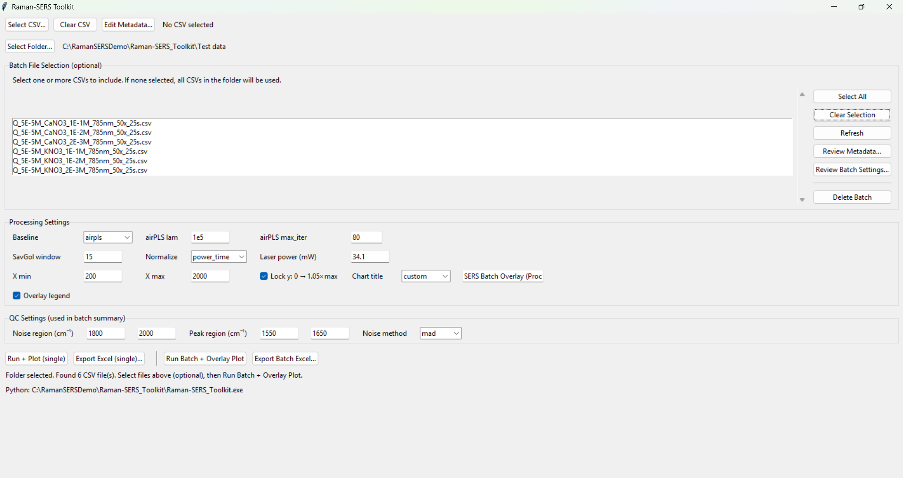
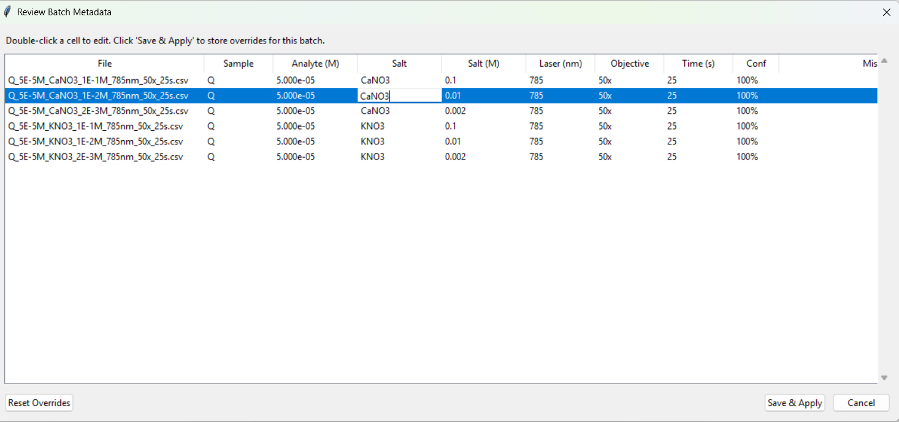
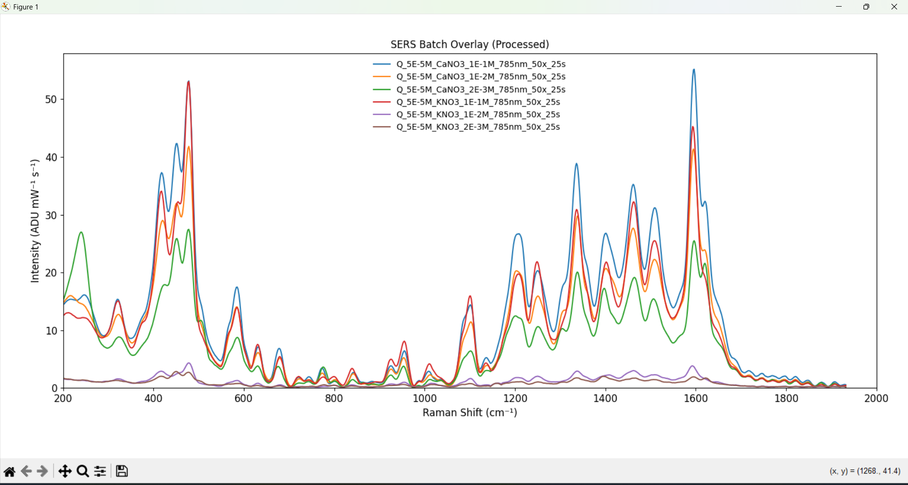
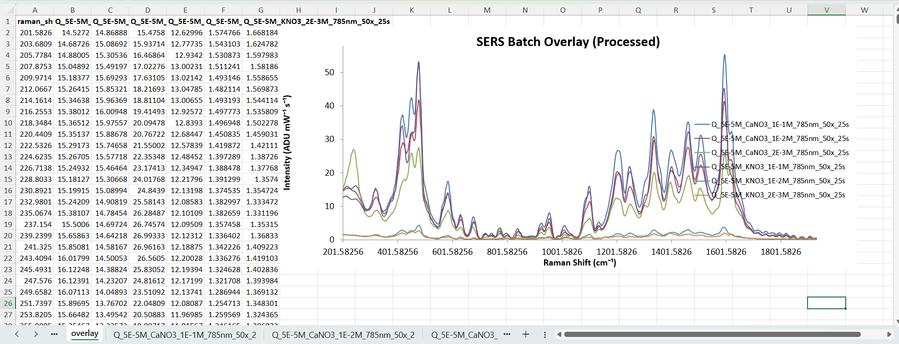
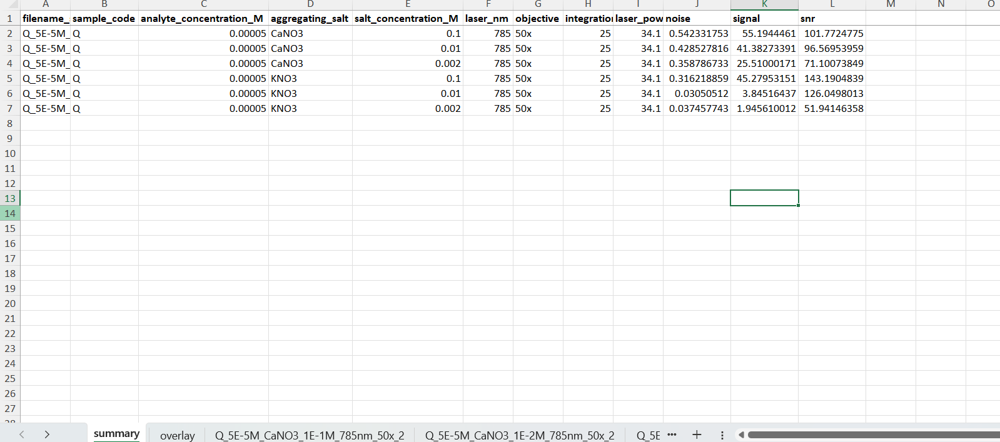

# Raman-SERS-Toolkit

Python desktop application for Raman/SERS spectrum processing end-to-end:

**Load CSV → robust metadata extraction → preprocessing (baseline, smoothing, normalization incl. Intensity/(mW·s)) → QC (noise, SNR) → publication-ready Excel export (Excel-native charts).**

> 🔒 Source code is currently private (research workflow + packaging details).  
> ✅ This repo provides a full demo: screenshots, sample data, and example outputs.  
> 📩 Code access / executable available upon request.

---

## Demo

- 🎥 Demo video: (https://youtu.be/jYX_Y3pQTu4)

- 🖼️ Screenshots:

**1) Main workflow (batch + single-file support)**  
Load a folder of Raman/SERS CSV spectra, optionally select a subset, configure preprocessing (baseline, smoothing, normalization) and QC regions, then run overlay plots or export Excel reports.

**2) Robust metadata extraction + manual correction**  
Messy filenames are parsed into structured metadata (sample, concentration, salt, laser, objective, integration time, etc.). Double-click any cell to correct values and save overrides for reproducible re-runs.

**3) Publication-style overlay plot (processed spectra)**  
Batch overlay plot after preprocessing (baseline correction + smoothing + normalization). Useful for quick comparison across conditions and replicates.

**4) Excel export with Excel-native charts**  
Exports a multi-sheet workbook containing processed spectra and an Excel-native chart, so collaborators can adjust formatting directly in Excel without Python.

**5) QC summary (noise / signal / SNR)**  
Automatically computes QC metrics per spectrum (noise, signal, SNR) and writes a batch summary table alongside key metadata to support consistent acceptance criteria.

---

## Key features

### Data ingestion
- Loads Raman/SERS CSV spectra (2-column wavenumber + intensity)
- Batch folder mode + multi-spectrum overlays

### Metadata handling (messy filenames)
- Best-effort filename parsing (supports inconsistent naming)
- Editable metadata table inside the app
- Sidecar `metadata.csv` to preserve corrected metadata for reproducible re-runs

### Preprocessing (reproducible + parameterized)
- Baseline correction: stable airPLS (plus ALS / polynomial options)
- Smoothing: Savitzky–Golay
- Normalization options:
  - Max / area / vector (configurable)
  - **Power × time normalization:** `Intensity / (mW·s)` for cross-run comparability

### QC metrics
- Noise estimation (robust methods)
- SNR calculation for peak-based assessment
- QC summary table across batches

### Export
- Publication-ready Excel workbook:
  - raw vs processed spectra
  - QC tables
  - Excel-native charts (easy to tweak without Python)

### Deployment
- Can be packaged as a Windows standalone `.exe` (PyInstaller)

### Tech
- UI: Tkinter
- Core: NumPy/SciPy + matplotlib
- Export: Excel writer (xlsxwriter) 
---

## Try the demo (no code needed)

1) Download sample spectra from:
- examples/sample_data/Sample_data.csv

2) View example outputs:
- examples/example_output/example_output.xlsx

---

## Input format

CSV with columns:
- `wavenumber` (cm⁻¹)
- `intensity` (a.u.)

The demo data is synthetic/anonymized and safe to share.

---

## Roadmap (near-term)

- Presets per instrument / acquisition settings
- Baseline visualization overlay (baseline + corrected view)
- More robust filename parsing rules + importable parsing templates
- CLI mode for automation (optional)

---

## Data privacy

See `docs/data-privacy.md`.

---

## License

MIT License

Copyright (c) 2026-Quang Hung Tran 

Permission is hereby granted, free of charge, to any person obtaining a copy
of this software and associated documentation files (the "Software"), to deal
in the Software without restriction, including without limitation the rights
to use, copy, modify, merge, publish, distribute, sublicense, and/or sell
copies of the Software, and to permit persons to whom the Software is
furnished to do so, subject to the following conditions:

The above copyright notice and this permission notice shall be included in all
copies or substantial portions of the Software.

THE SOFTWARE IS PROVIDED "AS IS", WITHOUT WARRANTY OF ANY KIND, EXPRESS OR
IMPLIED, INCLUDING BUT NOT LIMITED TO THE WARRANTIES OF MERCHANTABILITY,
FITNESS FOR A PARTICULAR PURPOSE AND NONINFRINGEMENT. IN NO EVENT SHALL THE
AUTHORS OR COPYRIGHT HOLDERS BE LIABLE FOR ANY CLAIM, DAMAGES OR OTHER
LIABILITY, WHETHER IN AN ACTION OF CONTRACT, TORT OR OTHERWISE, ARISING FROM,
OUT OF OR IN CONNECTION WITH THE SOFTWARE OR THE USE OR OTHER DEALINGS IN THE
SOFTWARE.

